# SACHITH Dev Pulse

A custom animated GitHub profile activity bar for **Sachith**.



## Install on your GitHub profile

1. Copy these files into your GitHub profile repository (normally the repo named exactly the same as your GitHub username).
2. Open `config.json` and confirm `github_username` is correct.
3. Commit and push to the `main` branch.
4. Open **Actions** → **Update Dev Pulse** → **Run workflow** once.
5. Add this line wherever you want the bar in your profile `README.md`:

```md
<p align="center">
  
</p>
```

## What it does

- Reads your latest **public GitHub activity**.
- Shows `ACTIVE NOW`, `RECENTLY ACTIVE`, `IDLE`, or `OFFLINE`.
- Shows the latest public repository, event type, detected repo language, and last activity age.
- Regenerates automatically every 10 minutes with GitHub Actions.
- Uses only Python standard library; there are no package dependencies.

## Status logic

- `ACTIVE NOW`: latest public event <= 20 minutes ago
- `RECENTLY ACTIVE`: <= 3 hours ago
- `IDLE`: <= 24 hours ago
- `OFFLINE`: > 24 hours ago

You can change the thresholds inside `config.json`.

## Important limitation

This reflects **public GitHub activity**, not true keyboard/IDE presence. GitHub's public events can be delayed, and private-repository work will not appear through the public-events feed. A local IDE heartbeat can be added later if you want a more real-time `CODING NOW` state.
