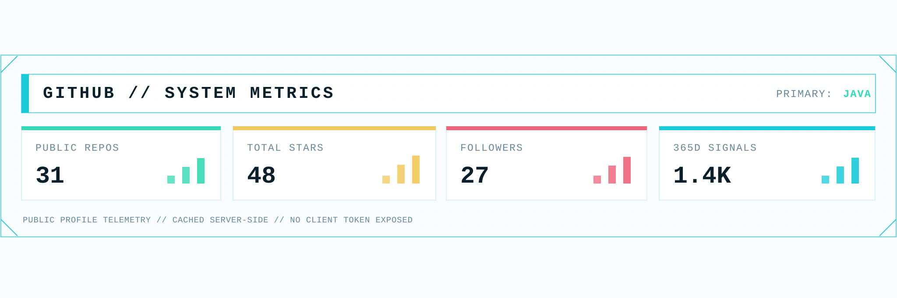
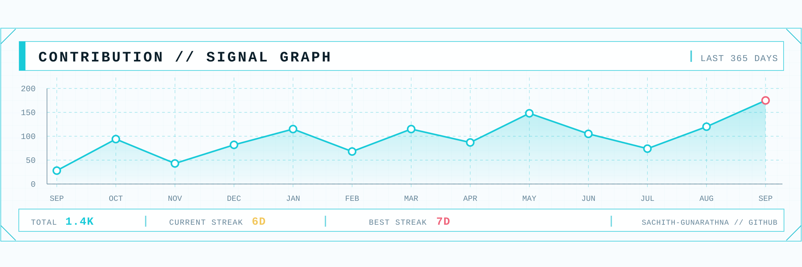
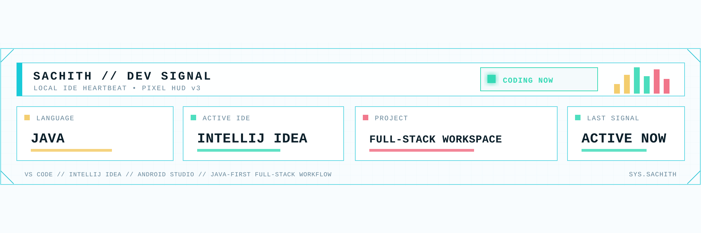

# GitHub README snippet

Place the `assets/status` folder inside your profile repository, then add this to your profile `README.md`:

```html
<p align="center">
  <picture>
    <source media="(prefers-color-scheme: dark)" srcset="./assets/status/system-metrics-dark.svg">
    <source media="(prefers-color-scheme: light)" srcset="./assets/status/system-metrics-light.svg">
    
  </picture>
</p>

<p align="center">
  <picture>
    <source media="(prefers-color-scheme: dark)" srcset="./assets/status/contribution-signal-dark.svg">
    <source media="(prefers-color-scheme: light)" srcset="./assets/status/contribution-signal-light.svg">
    
  </picture>
</p>

<p align="center">
  <picture>
    <source media="(prefers-color-scheme: dark)" srcset="./assets/status/dev-signal-dark.svg">
    <source media="(prefers-color-scheme: light)" srcset="./assets/status/dev-signal-light.svg">
    
  </picture>
</p>
```

GitHub will automatically display the light or dark version according to the viewer's theme.
